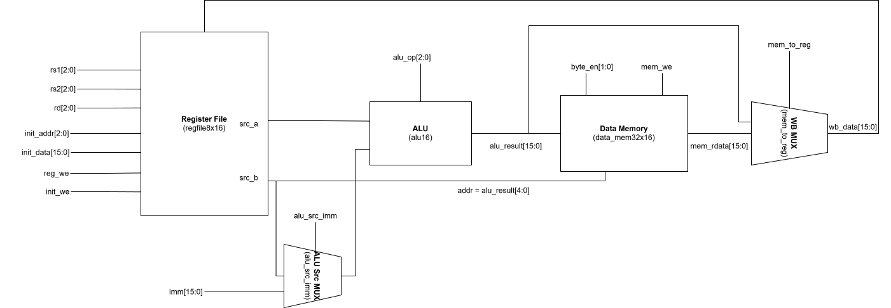
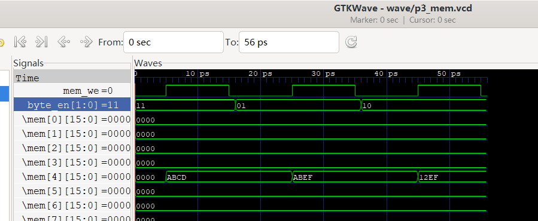
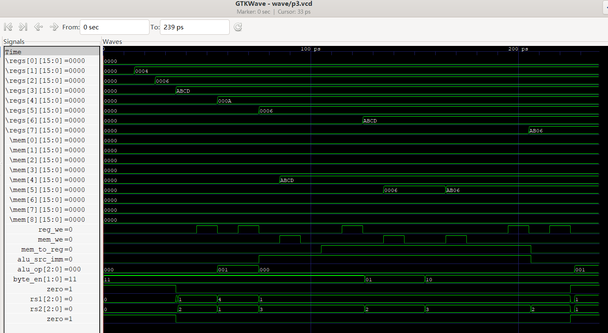

# 题目三：支持 Load/Store 的简化运算与存储数据通路设计

## 1. 设计概述

本题在题目二数据通路基础上加入数据存储器与访存控制信号，实现寄存器型运算、Load、Store 三类操作。

## 2. 数据通路图

## 3. 数据存储器单独测试（byte_en）

测试序列与结果：

- 写入 `16'hABCD` 到 `Mem[4]`，读回 `16'hABCD`
- 仅写低字节 `16'h00EF` 到 `Mem[4]`，读回 `16'hABEF`
- 仅写高字节 `16'h1200` 到 `Mem[4]`，读回 `16'h12EF`

波形输出：`wave/p3_mem.vcd`

## 4. 模块组成

- `alu16`：16 位运算单元
- `regfile8x16`：8x16 寄存器堆（组合读、同步写，R0 恒为 0）
- `data_mem32x16`：32x16 数据存储器（组合读、同步写，支持字节写使能）

## 5. 关键控制逻辑

- ALU 第二操作数选择：`alu_src_imm` 选择 `imm` 或 `src_b`
- 写回数据选择：`mem_to_reg` 选择 `mem_rdata` 或 `alu_result`
- `init_we` 优先：写地址/写数据由 `init_addr/init_data` 覆盖常规写回

## 6. 测试步骤与预期结果

1. 复位系统
2. 初始化：R1=0x0004，R2=0x0006，R3=0xABCD
3. R4=R1+R2=0x000A
4. R5=R4-R1=0x0006
5. Store：Mem[R1+0]=R3
6. Load：R6=Mem[R1+0]=0xABCD
7. 低字节 Store：Mem[R1+1] 低字节写入 R2[7:0]
8. 高字节 Store：Mem[R1+1] 高字节写入 R3[15:8]
9. 写 R0 验证保护
10. 产生 ALU 结果为 0，验证 `zero` 标志

## 7. 控制信号表

说明：当 `mem_we = 0` 时，`byte_en` 不影响写入；表中仍保持 2'b11 作为默认值。

| 步骤 | 操作 | reg_we | mem_we | mem_to_reg | alu_src_imm | alu_op | byte_en |
|---:|---|:---:|:---:|:---:|:---:|:---:|:---:|
| 1 | 复位系统 | 0 | 0 | 0 | 0 | x | 00 |
| 2 | 初始化寄存器 | 1 | 0 | 0 | 0 | x | 00 |
| 3 | R4 = R1 + R2 | 1 | 0 | 0 | 0 | ADD | 11 |
| 4 | R5 = R4 - R1 | 1 | 0 | 0 | 0 | SUB | 11 |
| 5 | Store: Mem[R1+0] = R3 | 0 | 1 | x | 1 | ADD | 11 |
| 6 | Load: R6 = Mem[R1+0] | 1 | 0 | 1 | 1 | ADD | 11 |
| 7 | Store 低字节: Mem[R1+1] | 0 | 1 | x | 1 | ADD | 01 |
| 8 | Store 高字节: Mem[R1+1] | 0 | 1 | x | 1 | ADD | 10 |
| 9 | 写 R0（保护验证） | 1 | 0 | 0 | 0 | ADD | 11 |
| 10 | Zero 标志验证 | 1 | 0 | 0 | 0 | SUB | 11 |

### 7.1 波形说明

波形文件位置：`wave/p3.vcd`

波形截图：

## 8. Load/Store 地址计算说明

Load/Store 中需要访问数据存储器，地址来自 `rs1 + imm`。ALU 用于完成该地址加法计算，输出 `alu_result`，再取其低 5 位作为 `mem_addr`。因此在 Load/Store 操作中，ALU 的角色是地址计算器，而非最终要写回的运算结果。

## 9. 关键多路选择信号说明

- `alu_src_imm`：控制 ALU 第二操作数来源。为 0 时选 `src_b`（寄存器型运算）；为 1 时选 `imm`（地址计算）。
- `mem_to_reg`：控制写回数据来源。为 0 时写回 `alu_result`；为 1 时写回 `mem_rdata`（Load）。

## 10. 字节写使能意义

`byte_en` 允许在 16 位存储单元中只修改高 8 位或低 8 位，避免破坏未更新的字节。用于实现按字节写入、结构体字段更新、以及与外设或协议的字节对齐访问。

## 11. 波形数据流说明

- 寄存器堆输出 `src_a/src_b` 作为 ALU 输入。
- 当 `alu_src_imm = 1` 时，ALU 用 `src_a + imm` 计算地址；当 `mem_we = 1` 时，`src_b` 经数据存储器写入 `Mem[addr]`。
- Load 时 `mem_we = 0`，数据存储器组合读出 `mem_rdata`，由 `mem_to_reg = 1` 选择写回寄存器堆。
