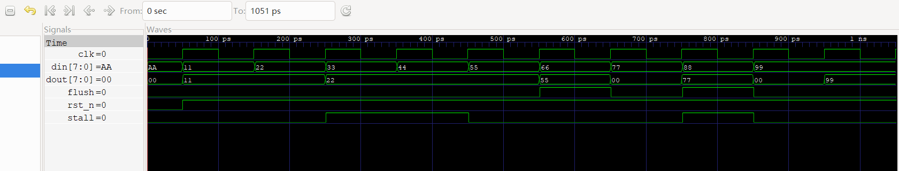

# 题目一：流水线寄存器设计

## 1. 设计概述

设计一个通用流水线寄存器模块 `pipe_reg`，用于五级流水线各阶段之间的数据传递与控制。模块参数化位宽 `WIDTH`，支持三种工作模式：正常传递、stall 保持、flush 清零，以及异步复位。

## 2. 模块接口

```
module pipe_reg #(parameter WIDTH = 32) (
    input  wire             clk,
    input  wire             rst_n,     // 异步复位，低有效
    input  wire             stall,     // 流水线阻塞
    input  wire             flush,     // 流水线冲刷（插入气泡）
    input  wire [WIDTH-1:0] din,
    output reg  [WIDTH-1:0] dout
);
```

| 信号 | 方向 | 位宽 | 说明 |
|------|------|------|------|
| `clk` | input | 1 | 时钟 |
| `rst_n` | input | 1 | 异步复位，低有效，最高优先级 |
| `stall` | input | 1 | 为 1 时保持当前值不变 |
| `flush` | input | 1 | 为 1 时清零输出（插入 NOP 气泡） |
| `din` | input | WIDTH | 输入数据 |
| `dout` | output | WIDTH | 输出数据（寄存器） |

## 3. 控制逻辑

优先级从高到低：

1. **`rst_n = 0`**：异步复位，`dout` 立即清零，与 clk/stall/flush 无关
2. **`flush = 1`**：在时钟上升沿将 `dout` 清零（插入气泡），优先级高于 stall
3. **`stall = 1`**：在时钟上升沿保持 `dout` 不变
4. **正常传递**：`dout <= din`

使用 `always @(posedge clk or negedge rst_n)` 描述。

flush 的典型应用场景：当流水线需要取消已取出的指令时（如 load-use 冒险中冲刷 ID/EX 阶段），通过 flush = 1 将其输出清零，等效于插入一条 NOP 指令。

## 4. 流水线寄存器在五级流水线中的作用

在五级流水线（IF → ID → EX → MEM → WB）中，各级之间通过流水线寄存器隔离。`pipe_reg` 作为通用模块，在 CPU 中被实例化四次（IF/ID、ID/EX、EX/MEM、MEM/WB），承担以下核心功能：

1. **数据传递**：将上一级的输出（指令字段、操作数、运算结果、控制信号等）寄存后传递给下一级，使各级可并行工作。
2. **流水线同步**：所有流水线寄存器共享同一时钟，确保每周期各段同时推进。
3. **流水线控制**：通过 stall/flush 机制精确控制流水线行为——
   - **stall**：当前级保持，后续指令等待（如 load-use 冒险中阻塞 IF/ID）
   - **flush**：当前级清零（插入 NOP 气泡），取消无效指令（如 load-use 冒险中冲刷 ID/EX）

## 5. stall 与 flush 的区别

| 维度 | stall | flush |
|------|-------|-------|
| **作用** | 保持当前值不变 | 清零输出（插入气泡/NOP） |
| **对流水线的影响** | 流水线暂停，各级保持不变 | 当前级被清空为 NOP，后续指令正常推进 |
| **典型场景** | 数据相关等待（load-use）、结构相关（资源冲突） | 分支预测失败取消指令、异常处理、load-use 中取消相关指令 |
| **实现方式** | `dout <= dout`（自保持） | `dout <= 0`（写零） |
| **对后续指令的影响** | 阻塞新指令进入 | 当前指令被"杀死"，不影响后续 NOP 行为 |

**本质区别**：stall 是"等一等"（流水线暂停），flush 是"不要了"（清除当前内容，插入无效操作）。

## 6. 为什么 flush 优先级高于 stall

若 stall 和 flush 同时为 1，必须优先响应 flush。原因：

1. **功能正确性**：flush 的目的是清除无效数据（如分支预测错误的指令、load-use 冒险中已过时的操作数）。若 stall 优先，无效数据将继续保持，后续可能被错误执行。
2. **流水线死锁预防**：stall + flush 同时发生的典型场景是 load-use 冒险——需要同时阻塞前级（IF/ID stall）并冲刷当前级（ID/EX flush）。若 stall 优先，flush 被忽略，气泡无法插入，冒险无法解决。
3. **硬件实现**：当 flush=1 时直接写零，比 stall 的条件判断更简单、更安全。flush 本质上是"强制清零"，应凌驾于任何保持操作之上。

## 7. 为什么异步复位 rst_n 优先级高于 flush 和 stall

1. **系统级安全**：复位是全局初始化信号，必须立即无条件将系统置于已知状态。无论流水线处于何种阻塞或冲刷状态，复位信号到来时必须立刻响应。
2. **异步特性**：`rst_n` 使用 `always @(posedge clk or negedge rst_n)` 的异步敏感列表，不依赖时钟沿即可触发，这是硬件复位的基本要求。
3. **优先级链**：`rst_n`（异步）> `flush`（同步清零）> `stall`（同步保持）构成完整的优先级体系。rst_n 凌驾于一切之上，确保系统在任何异常状态下都能被强制恢复。
4. **实际场景**：系统上电或异常恢复时，流水线中可能存在任意状态的垃圾数据。此时 flush 和 stall 可能是不可靠的信号，只有 rst_n 能保证所有寄存器回到确定的零状态。

## 8. 测试序列与预期

测试参数：`WIDTH = 8`

| 周期 | rst_n | stall | flush | din | 预期 dout | 说明 |
|-----:|:-----:|:-----:|:-----:|:------:|:---------:|------|
| 0 | 0 | 0 | 0 | 0xAA | 0x00 | 异步复位 |
| 1 | 1 | 0 | 0 | 0x11 | 0x11 | 正常传递 |
| 2 | 1 | 0 | 0 | 0x22 | 0x22 | 正常传递 |
| 3 | 1 | 1 | 0 | 0x33 | 0x22 | stall 保持 |
| 4 | 1 | 1 | 0 | 0x44 | 0x22 | stall 继续保持 |
| 5 | 1 | 0 | 0 | 0x55 | 0x55 | 恢复正常 |
| 6 | 1 | 0 | 1 | 0x66 | 0x00 | flush 清零 |
| 7 | 1 | 0 | 0 | 0x77 | 0x77 | 恢复正常（退出 flush） |
| 8 | 1 | 1 | 1 | 0x88 | 0x00 | flush 优先级 > stall |
| 9 | 1 | 0 | 0 | 0x99 | 0x99 | 确认退出 flush |

## 9. 测试结果

| 周期 | 预期 dout | 实际 dout | 是否正确 |
|-----:|:---------:|:---------:|:--------:|
| 0 | 0x00 | 0x00 | ✓ |
| 1 | 0x11 | 0x11 | ✓ |
| 2 | 0x22 | 0x22 | ✓ |
| 3 | 0x22 | 0x22 | ✓ |
| 4 | 0x22 | 0x22 | ✓ |
| 5 | 0x55 | 0x55 | ✓ |
| 6 | 0x00 | 0x00 | ✓ |
| 7 | 0x77 | 0x77 | ✓ |
| 8 | 0x00 | 0x00 | ✓ |
| 9 | 0x99 | 0x99 | ✓ |

**全部 10 个周期测试通过。**

## 10. 波形截图



波形周期标注：

| 周期 | 行为类型 | din → dout |
|-----:|------|:----------:|
| 0 | 异步复位 | 0xAA → **0x00** |
| 1 | 正常传递 | 0x11 → **0x11** |
| 2 | 正常传递 | 0x22 → **0x22** |
| 3 | stall 保持 | 0x33 → **0x22**（不变） |
| 4 | stall 保持 | 0x44 → **0x22**（不变） |
| 5 | 恢复正常 | 0x55 → **0x55** |
| 6 | flush 清空气泡 | 0x66 → **0x00** |
| 7 | 退出 flush | 0x77 → **0x77** |
| 8 | flush 优先于 stall | 0x88 → **0x00**（flush 胜出） |
| 9 | 最终恢复 | 0x99 → **0x99** |

波形文件：`wave/pipe_reg.vcd`

## 11. 设计要点

- **异步复位与同步控制分离**：`rst_n` 使用 `negedge rst_n` 敏感列表实现异步复位，flush/stall 在 `posedge clk` 时采样。
- **flush 清零的含义**：输出清零等效于插入 NOP。在后续题目中，flush 后的流水线寄存器会将 `op_type` 置为 `2'b00`（NOP），从而该指令在后续阶段不产生任何写操作。
- **stall 的实现方式**：`dout <= dout` 保持原值，配合流水线前级的 stall 信号阻止新数据进入。
- **波形观察时机**：dout 是寄存器输出，在时钟上升沿完成跳变。观察时应看上升沿之后的稳定值，而非上升沿之前。
