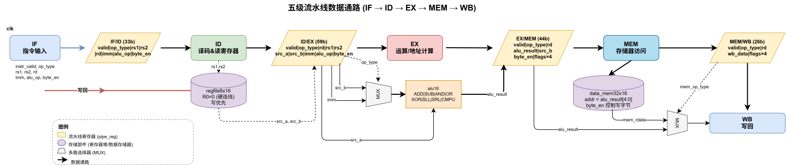
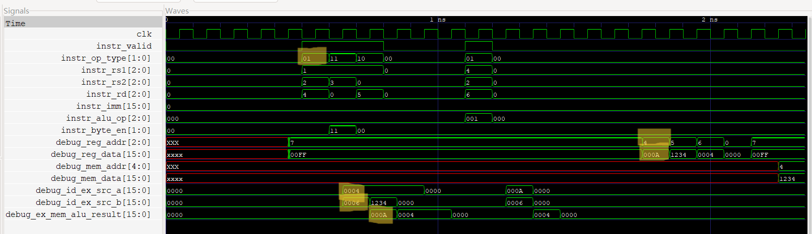

# 题目二：简化五级流水线数据通路设计

## 1. 设计概述

在流水线寄存器模块基础上，实现一个简化五级流水线 CPU（`simple_pipeline_cpu`），流水级为 IF → ID → EX → MEM → WB。集成 ALU、寄存器堆、数据存储器以及四组流水线寄存器（IF/ID、ID/EX、EX/MEM、MEM/WB）。外部以每周期一条"精简指令"的方式输入，显式插入 NOP 解决数据冒险。

## 2. 数据通路图



## 3. 模块接口

```
module simple_pipeline_cpu (
    input  wire        clk, rst_n,
    // 指令输入
    input  wire        instr_valid,
    input  wire [1:0]  instr_op_type,    // 00=NOP, 01=ALU, 10=LOAD, 11=STORE
    input  wire [2:0]  instr_rs1, instr_rs2, instr_rd,
    input  wire [15:0] instr_imm,
    input  wire [2:0]  instr_alu_op,
    input  wire [1:0]  instr_byte_en,
    // 初始化
    input  wire        init_we,
    input  wire [2:0]  init_addr,
    input  wire [15:0] init_data,
    // 调试
    input  wire [2:0]  debug_reg_addr,
    output wire [15:0] debug_reg_data,
    input  wire [4:0]  debug_mem_addr,
    output wire [15:0] debug_mem_data,
    output wire [15:0] debug_if_id_imm,
    output wire [15:0] debug_id_ex_src_a,
    output wire [15:0] debug_id_ex_src_b,
    output wire [15:0] debug_ex_mem_alu_result,
    output wire [15:0] debug_mem_wb_wb_data
);
```

## 4. 内部模块组成

| 模块 | 说明 |
|------|------|
| `pipe_reg` × 4 | IF/ID(33b)、ID/EX(59b)、EX/MEM(44b)、MEM/WB(26b) |
| `regfile8x16` | 8×16 寄存器堆，写优先，R0 恒为 0 |
| `alu16` | 16 位 ALU，支持 8 种运算 |
| `data_mem32x16` | 32×16 数据存储器，支持字节写使能 |

### 4.1 与作业 1 已有模块的差异

本题目中的 `alu16`、`regfile8x16`、`data_mem32x16` 在作业 1的基础上得来，并针对流水线 CPU 需求进行改动，主要改动如下：

**alu16**

直接复制作业 1 的完整 `alu16` 模块，包含全部 8 种操作（ADD/SUB/AND/OR/XOR/SLL/SRL/CMPU）和 4 个标志位（zero/carry/negative/overflow），未做任何简化。

**regfile8x16 扩展**

| 项目 | 作业 1 `regfile8x16` | 作业 2 `regfile8x16` |
|------|---------------------|---------------------|
| 写端口 | we、waddr、wdata | we、waddr、wdata（同左） |
| 初始化端口 | 无 | 新增 `init_we`、`init_addr`、`init_data` |
| 读端口 | raddr1→rdata1、raddr2→rdata2 | rs1→src_a、rs2→src_b（同功能） |
| 调试端口 | 无 | 新增 `debug_addr`→`debug_data` |

原因：testbench 需要通过 `init_we` 在仿真开始时初始化特定寄存器值（如 R1=0x0004），`debug_addr/data` 用于验证最终寄存器状态。`init_we` 优先级高于正常 WB 写回。

**data_mem32x16 扩展**

| 项目 | 作业 1 `data_mem32x16` | 作业 2 `data_mem32x16` |
|------|-----------------------|-----------------------|
| 复位 | 无 rst_n，用 `initial` 块初始化 | 新增 `rst_n`，用同步 `always` 块复位 |
| 读方式 | `always @(*) rdata = mem[addr]`（reg 型） | `assign rdata = mem[addr]`（wire 型） |
| 调试端口 | 无 | 新增 `debug_addr`→`debug_data` |

原因：增加 `rst_n` 使存储器可被复位信号统一控制；`assign` 组合读更简洁；`debug` 端口用于 testbench 验证存储器最终内容。

## 5. 各流水级功能

### IF 阶段

- 接收外部输入的简化的指令字段
- `instr_valid = 0` 时视为 NOP（`op_type = 2'b00`）
- 将指令字段打包送入 IF/ID 流水线寄存器

### ID 阶段

- 从 IF/ID 读取 rs1/rs2，访问寄存器堆获取操作数
- 组合读，本周期 WB 写入的新值在同周期可见（write-first）
- 将操作数和控制信号打包送入 ID/EX

### EX 阶段

- ALU 执行运算
- ALU / LOAD / STORE 时：`alu_src_imm = 1`，第二操作数选择 imm（地址计算）
- ALU 指令时：`alu_src_imm = 0`，第二操作数选择 src_b
- 运算结果送入 EX/MEM

### MEM 阶段

- 数据存储器访问
- 地址取 `alu_result[4:0]`
- STORE：`mem_we = 1`，将 src_b 写入存储器
- LOAD：`mem_we = 0`，组合读出 mem_rdata
- ALU/NOP：不访问存储器——MEM 阶段检查 `op_type`，发现是 ALU（不是 LOAD/STORE），直接放行，数据原样进入 MEM/WB

### WB 阶段

- LOAD 时：`mem_to_reg = 1`，写回 mem_rdata
- ALU 时：`mem_to_reg = 0`，写回 alu_result
- STORE/NOP：不写回
- R0 写保护

## 6. 测试序列

寄存器初始化：R1=0x0004, R2=0x0006, R3=0x1234, R7=0x00FF

| 周期 | 操作 | op_type | rs1 | rs2 | rd | imm | alu_op |
|-----:|------|:-------:|:---:|:---:|:--:|:---:|:------:|
| 1 | R4 = R1 + R2 | ALU(01) | 1 | 2 | 4 | 0 | ADD |
| 2 | Mem[R1+0] = R3 | STORE(11) | 1 | 3 | 0 | 0 | ADD |
| 3 | R5 = Mem[R1+0] | LOAD(10) | 1 | 0 | 5 | 0 | ADD |
| 4-6 | NOP | NOP(00) | - | - | - | - | - |
| 7 | R6 = R4 - R2 | ALU(01) | 4 | 2 | 6 | 0 | SUB |
| 8-11 | NOP | NOP(00) | - | - | - | - | - |

## 7. 预期结果

| 检查项 | 预期值 | 说明 |
|--------|:------:|------|
| R4 | 0x000A | R1+R2 |
| Mem[4] | 0x1234 | STORE R3 |
| R5 | 0x1234 | LOAD |
| R6 | 0x0004 | R4-R2 |
| R0 | 0x0000 | 写保护验证 |

## 8. 测试结果

| 检查项 | 预期 | 实际 | 是否正确 |
|--------|:----:|:----:|:--------:|
| R4 | 0x000A | 0x000A | ✓ |
| Mem[4] | 0x1234 | 0x1234 | ✓ |
| R5 | 0x1234 | 0x1234 | ✓ |
| R6 | 0x0004 | 0x0004 | ✓ |
| R0 | 0x0000 | 0x0000 | ✓ |

**全部测试通过。**

## 9. 每条测试指令在各周期的流水线阶段

| 周期 | 指令 | IF | ID | EX | MEM | WB |
|-----:|------|:--:|:--:|:--:|:---:|:--:|
| 1 | R4 = R1 + R2 | ✓ | | | | |
| 2 | Mem[R1+0] = R3 | ✓ | c1 | | | |
| 3 | R5 = Mem[R1+0] | ✓ | c2 | c1 | | |
| 4 | NOP | ✓ | c3 | c2 | c1 | |
| 5 | NOP | | ✓(NOP) | c3 | c2 | c1 |
| 6 | NOP | | | | c3 | c2 (STORE写Mem) |
| 7 | R6 = R4 - R2 | ✓ | | | | c3 (LOAD写R5) |
| 8 | NOP | ✓ | c7 | | | |
| 9 | NOP | | ✓(NOP) | c7 | | |
| 10 | NOP | | | ✓(NOP) | c7 | |
| 11 | NOP | | | | | c7 |

> 注：c1/c2/c3/c7 分别表示周期 1/2/3/7 的指令在各阶段的推进。NOP 在 ID 阶段被识别（op_type=00），后续 EX/MEM/WB 均不产生写操作。

## 10. 四组流水线寄存器的内容

| 流水线寄存器 | 位宽 | 保存的数据和控制信号 |
|:-----------|:---:|------|
| **IF/ID** | 33b | `valid`(1) + `op_type`(2) + `rs1`(3) + `rs2`(3) + `rd`(3) + `imm`(16) + `alu_op`(3) + `byte_en`(2) |
| **ID/EX** | 59b | `valid`(1) + `op_type`(2) + `rd`(3) + `rs1`(3) + `rs2`(3) + `src_a`(16) + `src_b`(16) + `imm`(16) + `alu_op`(3) + `byte_en`(2) |
| **EX/MEM** | 44b | `valid`(1) + `op_type`(2) + `rd`(3) + `alu_result`(16) + `src_b`(16) + `byte_en`(2) + `zero`(1) + `carry`(1) + `negative`(1) + `overflow`(1) |
| **MEM/WB** | 26b | `valid`(1) + `op_type`(2) + `rd`(3) + `wb_data`(16) + `zero`(1) + `carry`(1) + `negative`(1) + `overflow`(1) |

IF/ID 保存原始指令字段（未译码）；ID/EX 增加从寄存器堆读出的操作数 `src_a`/`src_b` 和用于转发的 `rs1`/`rs2`；EX/MEM 保存 ALU 运算结果和 STORE 数据 `src_b`；MEM/WB 保存最终写回数据（ALU 结果或 LOAD 读出的 `mem_rdata`）。

## 11. 为什么控制信号必须随数据一起传递

在流水线 CPU 中，指令的**控制信号在译码阶段（ID）确定**，但对应的**操作在后续阶段执行**。如果控制信号不跟随指令沿流水线传递：

1. **时序错位**：ID 阶段确定的 `op_type` 决定了 EX 阶段的 ALU 操作选择、MEM 阶段的存储器读写使能、WB 阶段的寄存器写使能。若控制信号不在流水线寄存器中逐级传递，后续阶段将不知道当前指令是什么操作。
2. **多指令共存**：流水线中同时存在多条指令的不同阶段，每条指令需要各自的控制信号。例如周期 4 中，IF 持有 NOP、ID 持有 LOAD(c3)、EX 持有 STORE(c2)、MEM 持有 ALU(c1)——四条指令各有不同的 `op_type`，必须各自携带。
3. **控制信号传递路径**：`op_type`、`alu_op`、`byte_en` 在 IF/ID→ID/EX→EX/MEM→MEM/WB 全程传递；`alu_src_imm` 和 `mem_to_reg` 由 `op_type` 在相应阶段组合生成，无需额外存储。

## 12. 波形中的流水线流动标注



> 图中以 R4=R1+R2 为例，黄色高亮标注其从 IF→ID→EX→MEM→WB 的完整流动过程。其中 MEM 阶段检查 `op_type`，发现是 ALU（不是 LOAD/STORE），直接放行，数据原样进入 MEM/WB，最终在 WB 阶段写回 R4。

## 13. 使用调试端口展示最终结果

见 §16 波形截图末尾：`debug_reg_addr` 依次切换 4→5→6→0，对应的 `debug_reg_data` 和 `debug_mem_data` 分别输出 R4=0x000A、R5=0x1234、R6=0x0004、R0=0x0000 以及 Mem[4]=0x1234。

## 14. 与单周期数据通路的对比

| 维度 | 单周期数据通路（作业 1 P3） | 流水线数据通路（本题目） |
|------|--------------------------|------------------------|
| **执行模型** | 每条指令在一个周期内完成全部 5 个阶段 | 多条指令同时在 5 个阶段中重叠执行 |
| **吞吐率** | 1 指令/周期（但周期很长） | ~1 指令/周期（周期短，理想 IPC≈1） |
| **硬件利用率** | 低——ALU 仅在指令的 EX 阶段被使用 | 高——各部件在每个周期同时工作 |
| **关键路径** | 经过所有 5 个阶段的组合逻辑 | 仅为最慢的单个阶段（EX 或 MEM） |
| **数据冒险** | 不存在——单周期内完成读写 | 存在——需插入 NOP 或转发/阻塞 |
| **控制复杂度** | 简单——一条指令独占所有资源 | 复杂——需流水线寄存器、stall/flush 机制 |
| **寄存器文件** | 同步写，组合读（同作业 1） | 同步写（WB 阶段），组合读（ID 阶段）——写后读需等待 WB 完成 |

## 15. 为什么需要显式插入 NOP

P2 中**没有转发（forwarding）和阻塞（stall）机制**。当后续指令依赖前一条指令的计算结果时，必须等待前一条指令完成 WB（将结果写入寄存器堆），后续指令才能从寄存器堆读到正确值。

具体到测试序列：R6=R4-R2（周期 7）依赖 R4=R1+R2（周期 1）。R4 在周期 5 才完成 WB 写入，因此周期 2~6 不能执行任何依赖 R4 的指令。在周期 7 发送 R6=R4-R2 时，R4 已确定写入，`src_a` 读到正确的 0x000A。

若不加 NOP（例如将 R6=R4-R2 放在周期 2），则 ID 阶段读寄存器堆时 R4 尚未被写回（仍在流水线中），读到旧值，导致计算错误。P2 通过编译器/程序员显式插入 NOP 解决此问题，P3 通过转发和阻塞硬件自动解决。

## 16. 波形截图


波形文件：`wave/simple_pipeline_cpu.vcd`
