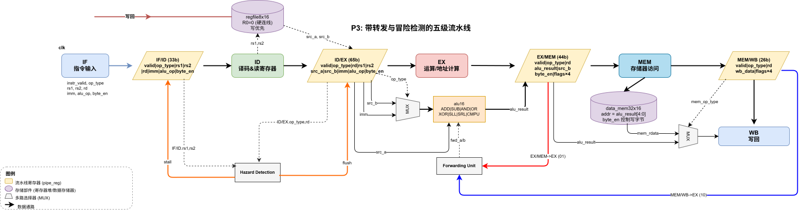
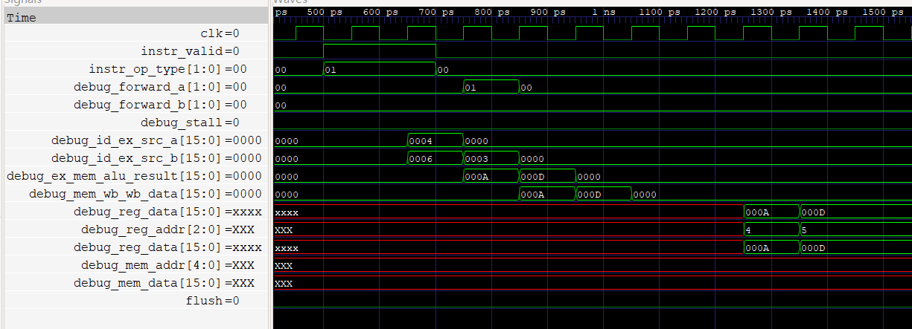
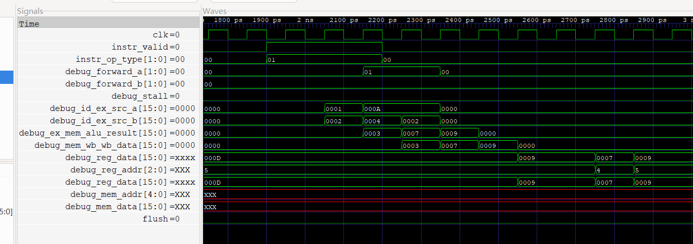
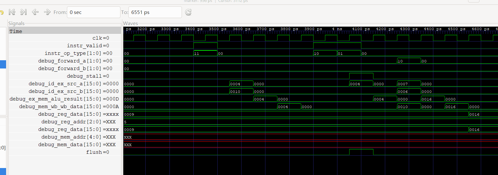
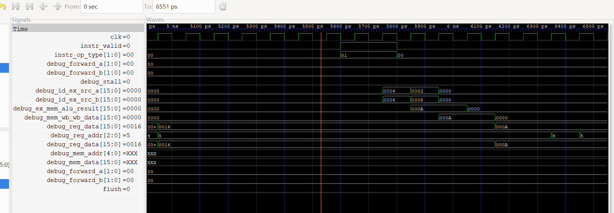

# 题目三：数据冒险转发与阻塞设计

## 1. 设计概述

在 P2 五级流水线基础上，增加 **转发单元（Forwarding Unit）** 和 **冒险检测单元（Hazard Detection Unit）**，使流水线能够在存在数据相关时自动通过转发或阻塞来保证正确性，无需显式插入 NOP。

## 2. 与 P2 的差异

| 改动 | P2 | P3 |
|------|-----|-----|
| ID/EX 位宽 | 59b | **65b**（新增 `rs1`(3b) + `rs2`(3b) 用于转发判断） |
| EX/MEM 位宽 | 44b | 44b（不变） |
| MEM/WB 位宽 | 26b | 26b（不变） |
| 转发单元 | 无 | 组合逻辑，判断 EX/MEM 和 MEM/WB 的 rd 是否匹配 EX 的 rs |
| 冒险检测 | 无 | 组合逻辑，检测 load-use 并生成 stall/flush |
| IF/ID stall | 恒为 0 | load-use 时拉高 1 周期 |
| ID/EX flush | 恒为 0 | load-use 时拉高 1 周期 |
| NOP 插入 | 显式（testbench 手动） | 硬件自动（flush 插入气泡） |

## 3. 数据通路图



> 图中实线为数据通路，虚线为转发路径和阻塞控制路径。红色线为 EX/MEM→EX 转发，蓝色线为 MEM/WB→EX 转发，`stall`/`flush` 由 Hazard Detection Unit 输出。

## 4. 新增接口

```
output wire [1:0] debug_forward_a,   // EX 第一操作数转发选择
output wire [1:0] debug_forward_b,   // EX 第二操作数转发选择
output wire       debug_stall        // load-use 阻塞信号
```

| 信号 | 位宽 | 说明 |
|------|:----:|------|
| `debug_forward_a` | 2 | 00=寄存器堆, 01=EX/MEM 转发, 10=MEM/WB 转发 |
| `debug_forward_b` | 2 | 同上 |
| `debug_stall` | 1 | load-use 冒险时置 1 |

## 5. 转发单元

### 5.1 转发通路

| 通路 | 源 | 转发值 | 条件 |
|------|------|------|------|
| EX/MEM → EX | EX/MEM 阶段 | `alu_result`（ALU 运算结果） | EX/MEM 有 ALU 指令，rd≠0，rd 匹配 EX 的 rs |
| MEM/WB → EX | MEM/WB 阶段 | `wb_data`（ALU 结果或 LOAD 数据） | MEM/WB 有 ALU/LOAD 指令，rd≠0，rd 匹配 EX 的 rs |

### 5.2 为什么 EX/MEM 优先级高于 MEM/WB

当同一个源寄存器同时被 EX/MEM 和 MEM/WB 匹配时（如测试 2 周期 5），必须优先选择 EX/MEM，因为：

1. **数据更新**：EX/MEM 中的值是**最近**一条指令刚算出来的；MEM/WB 中的值是**上上条**指令的结果。取用旧值会导致错误。
2. **实例（测试 2 周期 5）**：连续两条指令都写 R4——c2 算出的 R4=7 在 EX/MEM，c1 算出的 R4=3 在 MEM/WB。c3 需要 R4，必须取 7 而非 3。
3. **代码实现**：if-else 结构中先判断 EX/MEM，命中后不再判断 MEM/WB，天然保证了这一优先级。

**优先级**：EX/MEM 先于 MEM/WB 判断，同一 rs 匹配两者时取 EX/MEM。

### 5.3 转发判断表达式

为 EX 阶段 ALU 的每个操作数，按以下条件生成 `forward_a` / `forward_b`：

```
// forward_a 判断（对应 EX 阶段 rs1）
if (EX/MEM.valid && EX/MEM.op_type==ALU && EX/MEM.rd!=0 && EX/MEM.rd==EX.rs1)
    forward_a = 2'b01;       // EX/MEM → EX
else if (MEM/WB.valid && (MEM/WB.op_type==ALU||LOAD) && MEM/WB.rd!=0 && MEM/WB.rd==EX.rs1)
    forward_a = 2'b10;       // MEM/WB → EX
else
    forward_a = 2'b00;       // 寄存器堆

// forward_b 同理，将 EX.rs1 替换为 EX.rs2
```

| 条件 | forward_a/b | 转发源 | 数据 |
|------|:----------:|------|------|
| rs ≠ 0 且匹配 EX/MEM.rd（ALU 指令） | 2'b01 | EX/MEM | `mem_alu_result` |
| rs ≠ 0 且匹配 MEM/WB.rd（ALU/LOAD 指令） | 2'b10 | MEM/WB | `wb_data` |
| 以上均不满足 | 2'b00 | 寄存器堆 | `ex_src_a` / `ex_src_b` |

**优先级**：EX/MEM 先于 MEM/WB 判断，同一 rs 匹配两者时取 EX/MEM。

### 5.4 为什么转发无法消除 load-use 冒险

LOAD 数据在 **MEM 阶段末尾**才从存储器读出。当后续指令在 EX 阶段需要此数据时，即使转发也无法获取——因为 LOAD 尚未进入 MEM/WB，数据还不存在。唯一解决方法是**阻塞流水线一周期**：让后续指令在 ID 阶段等待，直到 LOAD 进入 MEM/WB 后，通过 MEM/WB→EX 转发获得数据。

### 5.5 R0 例外

当源寄存器为 R0 时（rs = 0），不进行转发（R0 恒为 0）。

## 6. 冒险检测单元

### 6.1 Load-Use 冒险检测条件

当 ID/EX 阶段为 LOAD 指令，且其目标寄存器 rd 与 IF/ID 阶段的源寄存器 rs1 或 rs2 匹配时（rd ≠ 0），触发 load-use 冒险。

### 6.2 阻塞响应

- **stall = 1**：阻塞 IF/ID 流水线寄存器（保持当前值不变）
- **flush = 1**：冲刷 ID/EX 流水线寄存器（插入 NOP 气泡）

阻塞持续一个周期后：LOAD 指令进入 MEM/WB，相关指令重新进入 EX，通过 MEM/WB → EX 转发获得 LOAD 数据。

## 7. 测试用例

### 测试 1：ALU → ALU 转发

初始化：R1=0x0004, R2=0x0006, R3=0x0003

| 周期 | R4=R1+R2 (c1) | R5=R4+R3 (c2) | forward_a | 说明 |
|-----:|:---:|:---:|:---------:|------|
| 1 | IF | | 00 | c1 取指 |
| 2 | ID | IF | 00 | c1 译码读 R1/R2；c2 取指 |
| 3 | EX | ID | 00 | c1 进入 ALU 计算 0x000A |
| 4 | MEM | EX | **01** | c1 的 0x000A 在 EX/MEM；c2 需要 R4 → EX/MEM 转发 |
| 5 | WB | MEM | 00 | c1 写回 R4；c2 结果进 MEM |
| 6 | | WB | 00 | c2 写回 R5=0x000D |

预期：R4 = 0x000A, R5 = 0x000D。周期 4 出现 forward_a=01。

### 测试 2：连续相关 + EX/MEM 优先级

初始化：R1=0x0001, R2=0x0002, R3=0x0004

| 周期 | R4=R1+R2 (c1) | R4=R4+R3 (c2) | R5=R4+R2 (c3) | fwd c2/c3 | 说明 |
|-----:|:---:|:---:|:---:|:---------:|------|
| 1 | IF | | | | c1 取指 |
| 2 | ID | IF | | | c1 译码，c2 取指 |
| 3 | EX | ID | IF | | c1 ALU→3，c2 译码，c3 取指 |
| 4 | MEM | EX | ID | 01/00 | c2 用 EX/MEM 转发 c1 的 R4=3，得 7 |
| 5 | WB | MEM | EX | 00/01 | c3 用 EX/MEM(c2→7) 而非 MEM/WB(c1→3) |
| 6 | | WB | MEM | | c3 结果进 MEM |
| 7 | | | WB | | c3 写回 R5=9 |

预期：R4=0x0007, R5=0x0009。周期 5 验证 EX/MEM(7) 优先于 MEM/WB(3)。

### 测试 3：Load-Use 阻塞

初始化：R1=0x0004, R2=0x0006, Mem[4]=0x0010

| 周期 | LOAD:c1 | ALU:c2 | stall | flush | ID/EX 内容 | 说明 |
|-----:|:---:|:---:|:-----:|:-----:|------|------|
| 1 | IF | | 0 | 0 | NOP | c1 取指 |
| 2 | ID | IF | 0 | 0 | c1(LOAD) | c1 译码，c2 取指 |
| 3 | EX | ID | **1** | **1** | c1→**气泡(NOP)** | 检测到 load-use！c2 译码发现需 R4，但 c1 尚未完成 |
| 4 | MEM | ID(重) | 0 | 0 | c2(ALU) | c1 读完 Mem 得 0x0010；c2 重新进入 ID→EX |
| 5 | WB | EX | 0 | 0 | c2 | c2 的 EX 通过 MEM/WB 转发获得 0x0010 |
| 6 | | MEM | | | c2 | c2 结果 0x0016 |
| 7 | | WB | | | | c2 写回 R5=0x0016 |

关键：周期 3 同时 stall(IF/ID) 和 flush(ID/EX)。stall 保持 c2 不丢失，flush 清空 ID/EX 插入气泡。周期 5 通过 MEM/WB→EX 转发 LOAD 数据。

预期：R4=0x0010, R5=0x0016。周期 3 可见 stall=1 且 ID/EX 被冲刷。

### 测试 4：无相关

初始化：R1=0x0004, R2=0x0006, R3=0x0002, R6=0x0008

| 周期 | R4=R1+R2 (c1) | R5=R3+R6 (c2) | fwd_a/b | stall | 说明 |
|-----:|:---:|:---:|:-------:|:-----:|------|
| 1 | IF | | 00 | 0 | c1 取指 |
| 2 | ID | IF | 00 | 0 | c1 译码，c2 取指 |
| 3 | EX | ID | 00 | 0 | c1 ALU；c2 的 rs1/rs2(R3/R6) 不匹配任何前序 rd |
| 4 | MEM | EX | 00 | 0 | 无转发需求 |
| 5 | WB | MEM | 00 | 0 | c1 写 R4 |
| 6 | | WB | | | c2 写 R5 |

预期：R4=0x000A, R5=0x000A。全程 forward_a/b=00, stall=0。

## 8. 测试结果

| 测试 | 检查项 | 预期 | 实际 | 是否正确 |
|------|--------|:----:|:----:|:--------:|
| 1 | R4 | 0x000A | 0x000A | ✓ |
| 1 | R5 | 0x000D | 0x000D | ✓ |
| 2 | R4 | 0x0007 | 0x0007 | ✓ |
| 2 | R5 | 0x0009 | 0x0009 | ✓ |
| 3 | R4 | 0x0010 | 0x0010 | ✓ |
| 3 | R5 | 0x0016 | 0x0016 | ✓ |
| 4 | R4 | 0x000A | 0x000A | ✓ |
| 4 | R5 | 0x000A | 0x000A | ✓ |

**全部 4 组测试通过，转发与阻塞逻辑正确。**

## 9. 波形截图

### 测试 1：ALU→ALU 转发


### 测试 2：连续相关 + EX/MEM 优先级


### 测试 3：Load-Use 阻塞


### 测试 4：无相关


波形文件：`wave/pipeline_cpu_hazard.vcd`

## 10. IPC 对比分析

| 方案 | 完成相同计算所需周期 | IPC |
|------|:------------------:|:---:|
| P2（显式 NOP） | ~14 cycles | ~0.36 |
| P3（转发+阻塞） | ~10 cycles | ~0.50 |

P3 通过转发消除了 ALU→ALU 数据相关所需的 2-3 个 NOP，通过单周期阻塞处理 load-use 冒险（对比 P2 需 2+ 个 NOP），显著提升了指令吞吐率。

## 11. 设计要点

- **转发仅在 EX 阶段**：只有 ALU 操作数（`src_a`, `src_b`）在进入 ALU 前进行转发选择。STORE 数据的写入依赖前一条指令结果的场景在本题测试中规避。

- **EX/MEM ≠ LOAD 转发**：EX/MEM 阶段不转发 LOAD 的数据（LOAD 数据仅在 MEM 阶段末尾才就绪），该约束确保了 MEM/WB 作为 LOAD 数据的唯一转发源。

- **load-use 不破坏流水线状态**：stall 保持 IF/ID 的同时 flush ID/EX，确保同一条指令不会重复执行。stall 释放后流水线自动恢复正确状态。

- **R0 特殊处理**：所有转发判断中排除 rs = 0 的情况，保证 R0 的恒零特性不被转发破坏。
